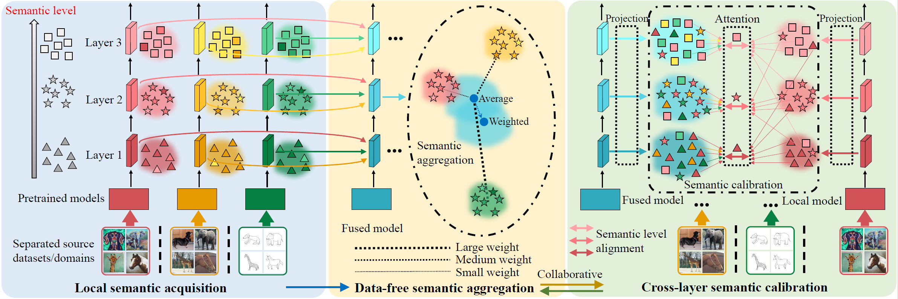

# CSAC

## Introduction
This repository contains the implementation code for paper:

**Collaborative Semantic Aggregation and Calibration for Separated Domain Generalization**

Junkun Yuan, Xu Ma, Defang Chen, Kun Kuang, Fei Wu, Lanfen Lin

*arXiv preprint, 2021*

[[arXiv](https://arxiv.org/abs/2110.06736)]

## Brief Abstract for the Paper
<p align="center">
     <br>
</p>

The existing domain generalization (DG) methods usually 
exploit the fusion of shared multi-source data for capturing domain invariance and training a generalizable model, which raises a dilemma between the generalization learning with shared multi-source data and the privacy protection of real-world sensitive data.

We introduce a separated domain generalization task with separated source datasets that can only be accessed locally for data privacy protection. 

We propose a novel solution called Collaborative Semantic Aggregation and Calibration (CSAC) to enable this challenging task via local semantic acquisition, data-free semantic aggregation, and cross-layer semantic calibration. 

## Requirements
You may need to build suitable Python environment by installing the following packages (Anaconda is recommended).
* python 3.8
* pytorch 1.8.1 (with cuda 11.3)
* torchvision 0.9.1
* tensorboardx 2.4
* numpy 1.21
* qpsolvers 1.7

Device:
* GPU with VRAM > 11GB (strictly).
* Memory > 8GB.

## Data Preparation
We list the adopted datasets in the following.

| Datasets | Download link|
| :-: | :- |
| PACS [1]</a> | https://dali-dl.github.io/project_iccv2017.html |
| VLCS [2] | http://www.mediafire.com/file/7yv132lgn1v267r/vlcs.tar.gz/file | 
<!-- |Office-Caltech-Home [4, 5] | https://people.eecs.berkeley.edu/~jhoffman/domainadapt & https://www.hemanthdv.org/officeHomeDataset.html| -->

Please note:
<!-- - Office-Caltech-Home dataset is constructed by choosing the common classes from Office-Caltech [5] and Office-Home [4] datasets (more details can be found in our paper). -->
- Our dataset split follows previous works like RSC ([Code](https://github.com/DeLightCMU/RSC)) [3].
- Although these datasets are open-sourced, you may need to have permission to use the datasets under the datasets' license. 
- If you're a dataset owner and do not want your dataset to be included here, please get in touch with us via a GitHub issue. Thanks!

## Usage
1. Prepare the datasets. 
2. Update ***root_dir*** in ***configs/datasets/dg/pacs.yaml/*** and ***configs/datasets/dg/vlcs.yaml/*** with the paths of PACS and VLCS datasets, respectively.
3. Run the code with command: 
```
nohup sh run.sh > run.txt 2>&1 &
```
4. Check results in ***logs/(dataset)_(network)/(target domain)/(time)/logs.txt*** .


<!-- ## Updates
- [01/01/2021] We uploaded a new arXiv version. See [new arXiv version](https://arxiv.org/abs/2110.06736). -->


## Citation
If you find our code or idea useful for your research, please consider citing our work.
```bib
@article{yuan2021collaborative,
  title={Collaborative Semantic Aggregation and Calibration for Separated Domain Generalization},
  author={Yuan, Junkun and Ma, Xu and Chen, Defang and Kuang, Kun and Wu, Fei and Lin, Lanfen},
  journal={arXiv e-prints},
  pages={arXiv--2110},
  year={2021}
}
```

## Contact
If you have any questions, feel free to contact us through email (yuanjk@zju.edu.cn or maxu@zju.edu.cn) or GitHub issues. Thanks!

## References
[1] Li, Da, et al. "Deeper, broader and artier domain generalization." Proceedings of the IEEE international conference on computer vision. 2017. 

[2] Fang, Chen, Ye Xu, and Daniel N. Rockmore. "Unbiased metric learning: On the utilization of multiple datasets and web images for softening bias." Proceedings of the IEEE International Conference on Computer Vision. 2013.

[3] Huang, Zeyi, et al. "Self-challenging improves cross-domain generalization." Computer Vision–ECCV 2020: 16th European Conference, Glasgow, UK, August 23–28, 2020, Proceedings, Part II 16. Springer International Publishing, 2020.

<!-- [4] Venkateswara, Hemanth, et al. "Deep hashing network for unsupervised domain adaptation." Proceedings of the IEEE conference on computer vision and pattern recognition. 2017.

[5] Saenko, Kate, et al. "Adapting visual category models to new domains." European conference on computer vision. Springer, Berlin, Heidelberg, 2010. -->

